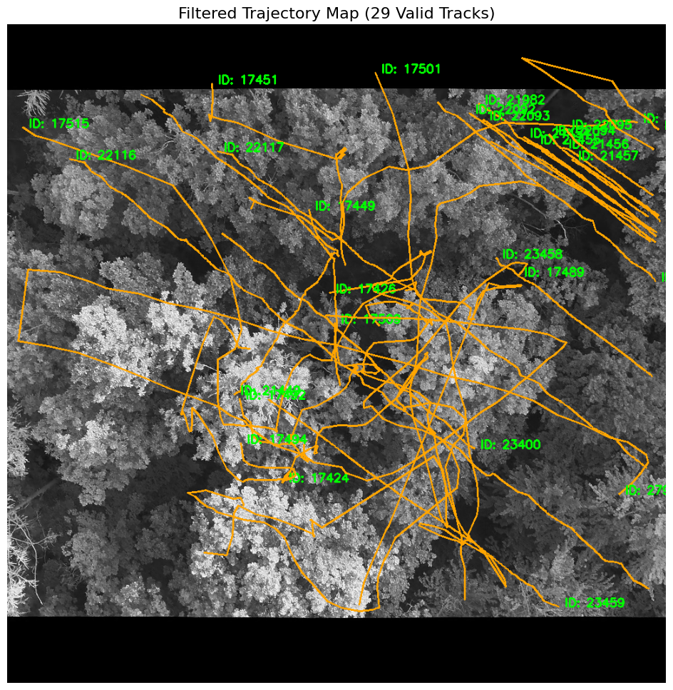
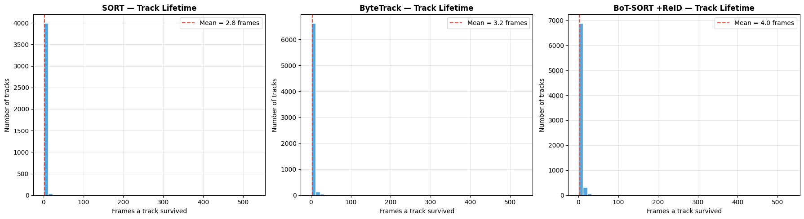
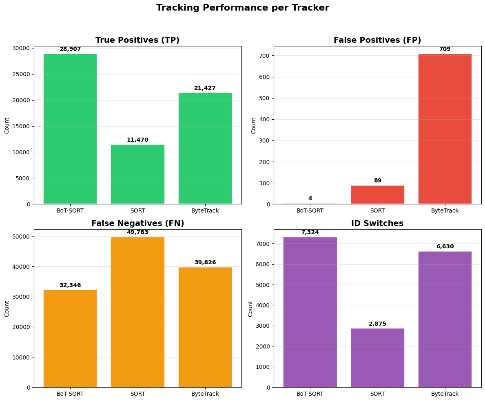

# Thermal Wildlife Detection and Tracking Pipeline

## 1. Project Overview
The objective of this project is to develop a robust, high-performance computer vision pipeline capable of detecting and continuously tracking wildlife in thermal video sequences. Multi-Object Tracking (MOT) in thermal imagery presents distinct challenges compared to standard RGB video, including an absolute lack of color texture, uniform heat signatures, and background thermal noise. This project implements, tunes, and systematically benchmarks multiple tracking paradigms on the **BAMBI Dataset** to establish the optimal architecture for automated thermal wildlife monitoring.

## 2. Dataset & Computer Vision Challenges
This pipeline is evaluated on the **BAMBI (Bounding boxes for Animals in Multi-species from Infrared cameras)** dataset. The specific subset utilized consists of **21,509 frames** spread across **240 unique video sequences**, annotated in COCO JSON format.

**Key Technical Hurdles in the BAMBI Dataset:**
* **Thermal Flickering & Target Camouflage:** Animals emit fluctuating thermal patterns that often blend directly into ambient background objects (e.g., sun-warmed soil, rocks). This causes bounding box detections to "flicker" and tracking states to drop out.
* **Lack of Visual Details:** Standard tracking models depend heavily on color histograms for re-identification. In thermal feeds, tracking must instead rely on spatial dynamics, shape properties, and specialized deep feature representations.
* **Severe Class Imbalance:** The BAMBI data is heavily skewed toward Wild Boars, with far fewer instances of Roe Deer, compounding the difficulty of consistent tracking across different species morphologies.

## 3. Methodology: Ground-Truth Isolation
To assess the pure tracking capability of each model in isolation, this pipeline bypasses traditional upstream object detectors (like YOLO). Instead, human-verified **Ground-Truth bounding boxes** are ingested directly from the COCO annotations into the tracking algorithms. This engineering architecture ensures that the tracking logic (spatial matching, Kalman state predictions, and ReID association) is mathematically evaluated without suffering penalties from a faulty or unoptimized object detector.

## 4. Phase 1: Trajectory Visualization & Noise Filtering (Notebook 06)
Before quantitative benchmarking, it was critical to visually verify that IDs were physically anchoring to the correct targets over time. A custom trajectory visualization pipeline was built using OpenCV.

**The Short-Track Filtering Algorithm:**
A major issue with thermal tracking is the generation of "blips"—micro-tracks caused by temporary background heat noise. To isolate true wildlife movement:
1. The geometric center `(x, y)` of every tracked bounding box was extracted and stored chronologically, keyed by its unique `track_id`.
2. A **diagnostic temporal filter** was applied to mathematically discard any track that existed for fewer than **60 consecutive frames**. 
3. This filter successfully eliminated hundreds of noisy thermal ID assignments, isolating **29 true, long-term wildlife trajectories**.

These continuous paths were rendered onto a master thermal canvas, connecting center points across frames to map the physical animal movement, with the ultimate persistent ID stamped at the terminal coordinate.



To further validate the system, the predicted BoT-SORT + ReID bounding boxes (colored by track ID) were overlaid against the white Ground-Truth boxes to ensure tight spatial convergence across various top-down thermal environments:


## 5. Phase 2: Architecture Benchmarking & Engineering (Notebook 07)
Four distinct tracking configurations were implemented and evaluated via the `BoxMOT` framework: SORT (Baseline), ByteTrack, BoT-SORT (Spatial-Only), and BoT-SORT + ReID.

Achieving state-of-the-art performance required two major engineering breakthroughs:

### A. Custom PyTorch Re-Identification (ReID) Wrapper
To enable deep Re-Identification on thermal images, a custom `OSNetReIDWrapper` class was developed to bridge Torchreid's OSNet with the BoxMOT framework. Thermal camera feeds lack regular RGB channels and crash standard Deep ReID libraries. This wrapper intercepts raw image patches, standardizes 1-channel grayscale numpy arrays into pseudo-RGB tensors, normalizes dimensions to a consistent `(256, 128)` layout, runs inference via FP16 CUDA acceleration, and safely flattens the output embeddings back into CPU-accessible Float32 arrays for the tracker.

### B. The Sequence Boundary Localization Fix & Track Lifetime
Initial test runs evaluated all 21,509 frames sequentially as a single continuous video feed. This architectural oversight caused tracking states and Kalman filters to "bleed" across entirely different video captures, corrupting metrics and instantly killing tracks at sequence transitions. 

The system was updated to explicitly parse file prefixes (`get_sequence_id`), grouping frames into their **240 localized video sequences**. Resetting the trackers inside localized boundaries prevented cross-video track bleeding. 

**Track Lifetime Improvement:**
Before the fix, tracks were prematurely dying, resulting in a mean track lifetime of just **4.0 frames** for BoT-SORT+ReID.



After isolating the sequence boundaries, the mean track lifetime jumped dramatically to **36.3 frames**, proving that tracks are now successfully surviving and persisting properly within their own isolated sequences.


## 6. Quantitative Evaluation & Metrics Comparison

| Tracker Paradigm | MOTA | IDF1 | IDSW | True Positives (TP) | False Negatives (FN) |
| :--- | :---: | :---: | :---: | :---: | :---: |
| **SORT (Baseline)** | 0.1389 | 0.2001 | **2,875** | 11,470 | 49,783 |
| **ByteTrack** | 0.2300 | 0.3010 | 6,630 | 21,427 | 39,826 |
| **BoT-SORT (Default)** | 0.3523 | 0.3856 | 7,324 | 28,907 | 32,346 |
| **BoT-SORT + ReID (Broken Boundaries)** | 0.3518 | 0.3855 | 7,343 | 28,898 | 32,355 |
| **BoT-SORT + ReID (Fixed Sequences)** | **0.3559** | **0.3883** | 7,409 | **29,216** | **32,037** |

### Visual Analytics & Critical Analysis

**1. Overall Tracker Accuracy & Identity Preservation**
BoT-SORT + ReID (Fixed) achieved the highest tracking efficiency, proving that localized deep feature extraction provides the most dependable tracking alignment in thermal conditions.


**2. Metric Breakdown Grid**
A closer look at the exact volume of successful matches versus hallucinated or missed targets. BoT-SORT effectively maximizes True Positives while keeping False Positives near zero (only 4 FP across 21k frames).


**3. The False Negative Problem**
Traditional SORT failed drastically, dropping nearly 50,000 False Negatives. BoT-SORT successfully recovered more than double the volume of valid target trajectories (29,216 TP). However, the high FN count across *all* trackers highlights the extreme difficulty of the BAMBI dataset's thermal flickering.


**4. Temporal Tracking Stability (Per-Frame TP)**
Mapping True Positives frame-by-frame reveals exactly where SORT drops out and where BoT-SORT maintains continuity during challenging thermal sequences. 


*Note on ID Switches:* While SORT displays a deceptively low ID switch count, it is only because the algorithm completely dropped tracks. BoT-SORT's higher ID switch count is a mathematical byproduct of actively maintaining tracks across thousands of difficult, textureless frames.

## 7. Future Work: Object Detection Optimization
With the MOT logic mathematically verified on the BAMBI dataset, the next phase focuses entirely on the upstream Object Detection phase. 
* A **YOLOv11** model will be trained specifically on these thermal sequences.
* To combat the extreme thermal flickering and feed consistent bounding boxes into BoT-SORT, the YOLO architecture will require heavy data augmentation targeting contrast, and an extended training schedule (150+ epochs) on RTX 40-series hardware to thoroughly map the subtle thermal gradients of Boars and Roe Deer.

## 8. Requirements & Setup
To run the benchmarking and visualization notebooks, ensure your environment has the following dependencies:
```bash
pip install torch torchvision torchreid boxmot filterpy opencv-python matplotlib scipy numpy