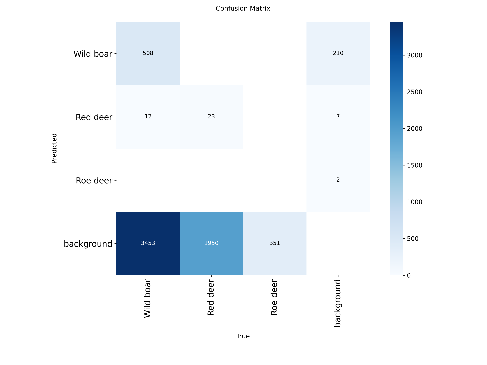
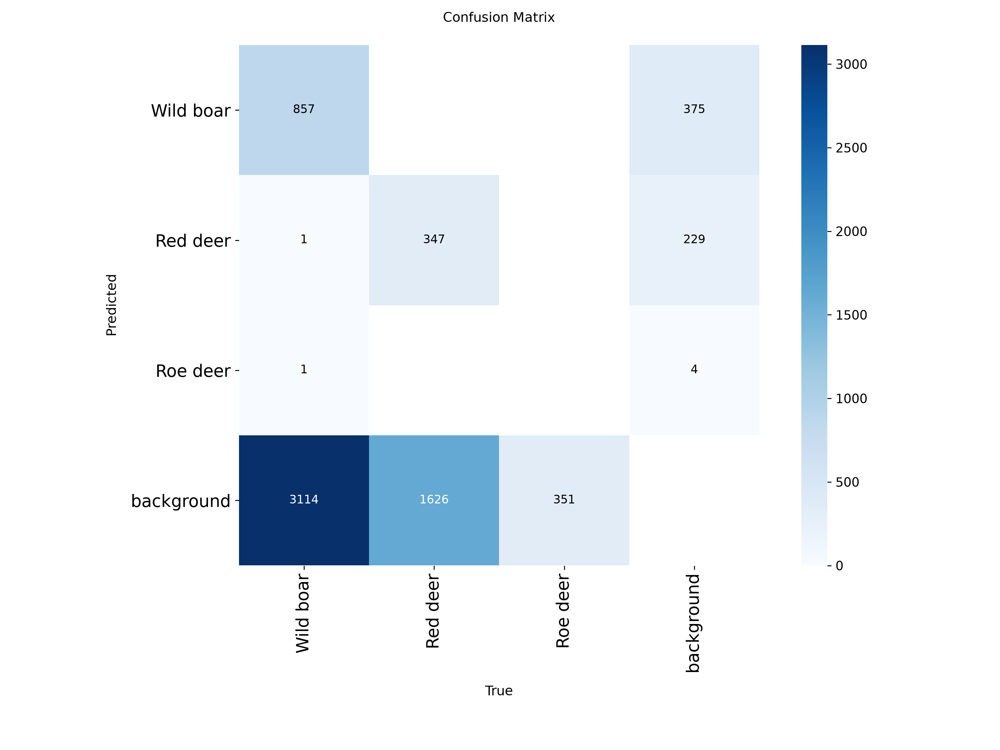
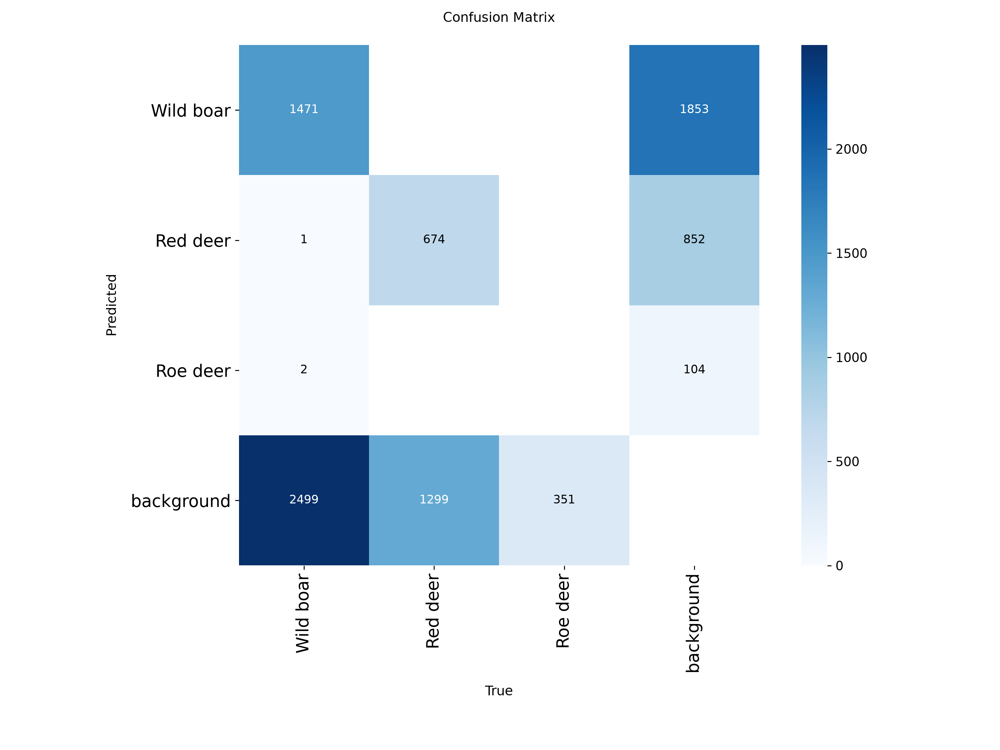
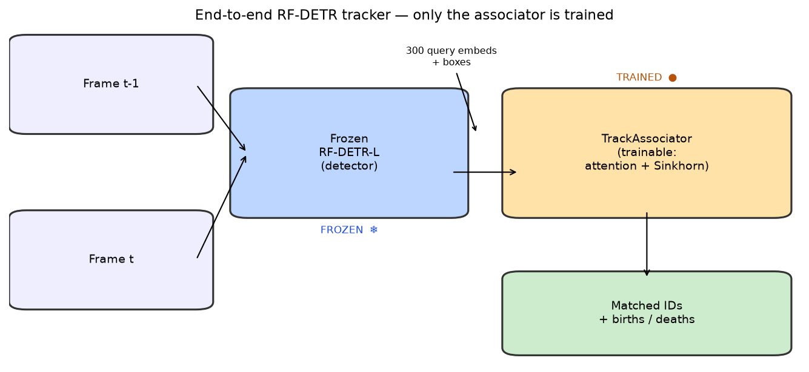
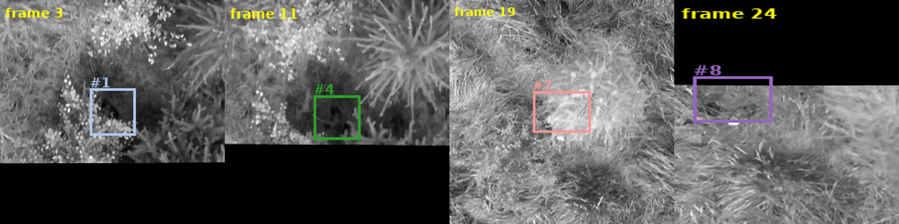
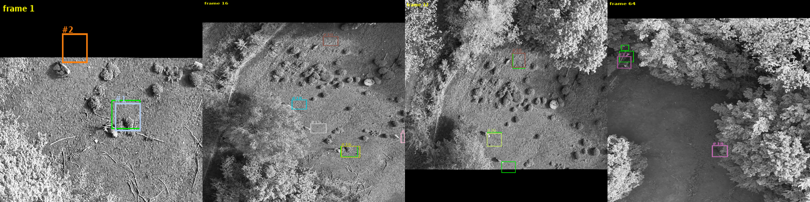

# BAMBI Wildlife MOT — Thermal Detection & Multi-Object Tracking

> Source material for the slide deck. Each `##` section maps roughly to one slide
> or a small group of slides. Images live in [images/](images/) and are
> referenced inline. Numbers are pulled directly from the code, reports and
> result files in the repo.

**Course:** CIV4 · **Team:** Stanislav Buinitski, Yahaya Danjuma, Navid Ghaderian, Afzaal Yasin
**Dataset:** BAMBI — *Bounding boxes for Animals in Multi-species from Infrared cameras* (https://www.bambi.eco/)

---

## 1. The one-line pitch

We benchmark and improve **Multi-Object Tracking (MOT)** for **aerial (nadir UAV)
thermal wildlife monitoring**, then build a **reproducible detection-training
stack** (YOLO26 + RF-DETR) on top of the same data — and finally close the loop
with a **learned transformer tracker** built on the trained detector.

Three threads, one dataset:

1. **Tracking** — given boxes, how well can we keep a stable identity on each
   animal across a thermal video? (Notebooks 06–07)
2. **Detection** — can we produce those boxes automatically with a trained
   thermal detector? (the `detection_models/` MLOps stack)
3. **End-to-end tracking** — can a network *learn* the association on top of our
   own detector? (the `transformer_tracking/` module, §16)

---

## 2. Why thermal wildlife tracking is hard

Thermal/infrared aerial footage breaks most assumptions that standard RGB
trackers rely on:

- **No color, no texture.** Classic Re-ID uses color histograms — useless on a
  grayscale heat blob. Association must fall back on motion, shape and learned
  deep features.
- **Thermal flickering & camouflage.** Animals' heat signatures fluctuate and
  blend into sun-warmed soil and rocks, so detections "flicker" in and out and
  tracks die.
- **Severe class imbalance.** The data is dominated by Wild Boar, with far fewer
  Roe/Red Deer — hard to track consistently across different body shapes.
- **Tiny targets, top-down view.** Nadir UAV perspective means small, low-detail
  objects.


*A sample BAMBI thermal frame with ground-truth boxes — note the low contrast and small targets.*

---

## 3. The dataset in numbers

| Quantity | Value |
|---|---|
| Tracking subset | **21,509 frames** across **240 video sequences** |
| Detection split — train | **17,684 images** |
| Detection split — val | **2,868 images** |
| Detection split — test | **3,277 images** |
| Classes (detection) | **3** — Wild boar (0), Red deer (1), Roe deer (2) |
| Tracking species | Wild Boar (dominant), Roe Deer |
| Annotation format | COCO JSON / BAMBI MOT → converted to YOLO |
| Image resolution | 1024 × 1024 |
| Raw image set on disk | ~16 GB |

Roughly **~91%** of sampled training frames contain at least one animal box; the
rest are intentional **background frames** (kept so the detector learns to say
"nothing here").

---

## 4. Preprocessing pipeline (notebooks 01 → 05)

Everything downstream — both the detector labels and the tracking annotations —
comes out of a single ordered, reproducible pipeline. This is where the raw
BAMBI footage becomes training-ready data.

### 4.1 Download (02_Download)

Flights are pulled from **Zenodo** via the dataset's own `download_from_zenodo.py`,
driven by a list of **flight keys** (`data/flight_keys.json`) and unzipped in
place. Each flight ships two artefacts:

- `{flight}_matched_processed.mp4` — a **side-by-side RGB | thermal** video
  (2048 px wide: RGB in the left 1024 px, thermal in the right 1024 px).
- `{flight}_gt.txt` — the **MOT ground truth** (CSV: `frame_id, track_id,
  bb_left, bb_top, bb_w, bb_h, …, visibility, species, …, is_propagated`).

### 4.2 Annotation parsing & filtering (03_Format_Conversion → `src/annotation_process.py`)

A **single pass** over each `_gt.txt` does three things at once:

- **Species → class id** via a fixed map: `Sus scrofa (Wild boar)→0`,
  `Cervus elaphus (Red deer)→1`, `Capreolus capreolus (Roe deer)→2`.
- **Two quality filters**, both defaulting on:
  - **visibility ≥ 0.3** — drop boxes too occluded to learn from;
  - **skip propagated** — drop `is_propagated == 1` boxes (interpolated
    annotations, not true observations).
- **Two output formats from one parse:** absolute MOT boxes are converted to
  **normalized YOLO** `cx cy w h` label files *and* to a single **COCO JSON**
  that **preserves `track_id`** (so the same source feeds detection *and*
  tracking). The function also records each track's **first/last frame span**,
  which later powers the lifetime analysis (§9) and the tracking-clip extraction.

### 4.3 Frame extraction (04_Frame_Extraction)

Frames are decoded from the videos with OpenCV. Two key operations:

- **Grayscale + thermal crop:** `cv2.cvtColor(frame, BGR2GRAY)[:, 1024:]` — take
  the **right half** of the side-by-side frame (the thermal pane) and keep it
  single-channel. This is why every image is `1024 × 1024` grayscale, named
  `{flight}_{frame:08d}.png`.
- **Deliberate background sampling:** all annotated frames are extracted, plus a
  random **10% of empty frames** (`bg_ratio = 0.10`) that get an **empty label
  file** — negatives so the detector learns to predict "nothing here". This is
  the source of the ~91% / 9% animal/background mix in §3.

A parallel `extract_tracking_clips()` pulls **contiguous clips** around each
track's life (from `first − 60` to `last + 30`, with nearby intervals merged)
for the tracking experiments.

### 4.4 Stratified, leakage-free split (05_Data_Split)

The split is done **by flight, never by frame** — all frames of one video go to
exactly one split, so near-identical consecutive frames can't leak between train
and test.

- `compute_flight_species()` records which species appear in each flight (under
  the same visibility / propagation filters).
- `stratified_flight_split()` groups flights by their **species signature**
  (e.g. *{boar}*, *{boar, roe}*), shuffles each group with a fixed **seed 42**,
  and splits **70 / 15 / 15** *within* each group — so rare-species flights are
  represented in every split.
- `build_yolo_structure()` materialises `data/yolo_data/{train,val,test}/{images,labels}`
  and writes `dataset.yaml`; a final pass assigns **`video_id` + `frame_id`** into
  the COCO file for the tracker.

> Net result: one parse produces YOLO labels, a track-preserving COCO file, and a
> reproducible, leakage-free split — the shared foundation for **all** of §5–§16.

---

## 5. Repository structure

```
BAMBI_MOT/
├── notebooks/                  # The tracking research pipeline (ordered 01→07)
│   ├── 01_Exploration.ipynb       # dataset EDA
│   ├── 02_Download.ipynb          # fetch BAMBI
│   ├── 03_Format_Conversion.ipynb # COCO/MOT → YOLO labels
│   ├── 04_Frame_Extraction.ipynb  # video → frames
│   ├── 05_Data_Split.ipynb        # train/val/test split
│   ├── 06_Run_Tracker.ipynb       # run trackers + trajectory viz
│   └── 07_Benchmark_Tracker.ipynb # HOTA/MOTA/IDF1 + analysis
│
├── src/                        # Reusable library code
│   ├── annotation_process.py      # BAMBI MOT → YOLO label writer
│   └── config.py                  # YAML config loader
│
├── detection_models/           # Self-contained detector training stack (MLOps)
│   ├── yolo26-s/ yolo26-l/         # Ultralytics YOLO26 train scripts
│   ├── rf-detr-s/ rf-detr-l/       # RF-DETR (DINOv2 backbone) train scripts
│   ├── tools/                      # benchmark, dataset views, reporting
│   ├── docker-compose.yml          # persistent MLflow server
│   ├── benchmark_speed.sh          # 4-model speed benchmark
│   ├── train_all.sh                # sequential training queue
│   └── reports/                    # speed_report.md/.pdf, annotation examples
│
├── transformer_tracking/       # Learned end-to-end tracker on frozen RF-DETR
├── data/yolo_data/{train,val,test}/{images,labels}   # (gitignored)
├── plots/                      # tracking result figures
└── pyproject.toml              # top-level package (bambi-mot)
```

**Design intent:** the repo is deliberately **layered**:

- A **research layer** (`notebooks/` + `src/`) — exploratory, narrative, for the
  tracking experiments.
- A **production-style layer** (`detection_models/`) — scripted, reproducible,
  experiment-tracked, isolated in its own virtual environment and Docker
  service. It treats detector training like an engineering pipeline, not a
  notebook.
- A **research-on-top layer** (`transformer_tracking/`) — a learned tracker that
  reuses the trained detector (§16).

---

## 6. Methodology decision: Ground-Truth Isolation

To measure **pure tracking quality**, the tracking benchmark deliberately
**bypasses the detector** and feeds **human-verified ground-truth boxes** straight
into the trackers.

**Why this matters:** it cleanly separates the two error sources. A bad MOTA
number now reflects the *tracker's* association logic (Kalman prediction, IoU
matching, Re-ID) and **not** a weak upstream detector. This isolates the variable
we're actually studying.

---

## 7. The trackers we compared

Four configurations, all run through the **BoxMOT** framework:

| Tracker | Idea | Re-ID |
|---|---|---|
| **SORT** | Kalman + IoU only (the baseline) | none |
| **ByteTrack** | also recovers low-confidence detections | none |
| **BoT-SORT** | camera-motion compensation + better matching | none |
| **BoT-SORT + ReID** | adds deep appearance features | **OSNet (custom wrapper)** |

---

## 8. Implementation highlight A — Custom thermal Re-ID wrapper

Deep Re-ID libraries assume 3-channel RGB and **crash** on single-channel thermal
input. We wrote an `OSNetReIDWrapper` to bridge **Torchreid's OSNet** into BoxMOT:

1. Intercepts raw thermal image patches (1-channel grayscale numpy).
2. Stacks them into **pseudo-RGB** tensors.
3. Normalizes every crop to a fixed **256 × 128** layout.
4. Runs inference with **FP16 CUDA** acceleration.
5. Flattens embeddings back to CPU **Float32** arrays the tracker can consume.

This is the piece that makes "appearance-based" tracking even *possible* on
colorless thermal data.

---

## 9. Implementation highlight B — The sequence-boundary bug (and the fix)

**The bug:** all **21,509 frames** were initially fed as one continuous video.
Kalman states and track IDs **bled across completely different captures**,
corrupting metrics and instantly killing tracks at every scene cut.

**The fix:** parse the filename prefix (`get_sequence_id`) to group frames into
their **240 real sequences**, and **reset the trackers at each boundary**.

**The payoff — mean track lifetime:**

| | Mean track lifetime (BoT-SORT + ReID) |
|---|---|
| Before fix (frames bleed across videos) | **4.0 frames** |
| After fix (per-sequence reset) | **36.3 frames** |

That's a **~9× improvement** in how long a track survives — the single most
impactful engineering change in the tracking pipeline.


*Before: tracks die almost immediately (mean 4.0 frames).*


*After: tracks persist within their own sequence (mean 36.3 frames).*

---

## 10. Implementation highlight C — Short-track noise filtering & trajectory mapping

Thermal noise produces "blips" — micro-tracks from transient hot spots. A
**diagnostic temporal filter discards any track shorter than 60 consecutive
frames**, leaving **29 true long-term wildlife trajectories** out of hundreds of
noisy IDs.

These surviving paths are rendered onto a master thermal canvas (built with
OpenCV) by connecting box centers frame-to-frame, with the persistent ID stamped
at the trajectory's end.


*29 filtered long-term trajectories drawn over the thermal canvas.*


*Predicted BoT-SORT+ReID boxes (colored by track ID) overlaid on white ground-truth boxes — tight spatial convergence.*

---

## 11. Tracking results

| Tracker | MOTA | IDF1 | IDSW | True Pos (TP) | False Neg (FN) |
|---|:---:|:---:|:---:|:---:|:---:|
| SORT (baseline) | 0.1389 | 0.2001 | 2,875 | 11,470 | 49,783 |
| ByteTrack | 0.2300 | 0.3010 | 6,630 | 21,427 | 39,826 |
| BoT-SORT (default) | 0.3523 | 0.3856 | 7,324 | 28,907 | 32,346 |
| BoT-SORT + ReID (broken boundaries) | 0.3518 | 0.3855 | 7,343 | 28,898 | 32,355 |
| **BoT-SORT + ReID (fixed sequences)** | **0.3559** | **0.3883** | 7,409 | **29,216** | **32,037** |

**Headline:** BoT-SORT + ReID with the sequence fix wins on every quality metric.
Compared to the SORT baseline it **more than doubles** true positives
(11,470 → 29,216) and **lifts MOTA by ~2.6×** (0.139 → 0.356).


**Reading the numbers carefully (a key talking point):**
- SORT's *low* ID-switch count is **deceptive** — it has few switches only
  because it **dropped most tracks entirely**. BoT-SORT's higher IDSW is the
  price of *actually maintaining* tracks across thousands of textureless frames.
- BoT-SORT keeps **false positives near zero (~4 FP across 21k frames)** while
  maximizing TP.
- The stubbornly high **False Negative** count across *all* trackers (~32k even
  for the best) is the honest signature of how hard thermal flickering is — the
  ceiling here is set by detection, which motivates the next layer.


*Per-frame TP shows exactly where SORT collapses and where BoT-SORT holds continuity.*

---

## 12. The detection stack — engineering decisions worth showing

`detection_models/` is a small but opinionated MLOps setup. Interesting choices:

- **One joined `uv` virtual environment** shared by all four models
  (YOLO26 + RF-DETR together), with **torch pinned to the CUDA 12.4 wheels** so
  the GPU build is reproducible.
- **Dockerized, persistent MLflow** (SQLite backend + artifact proxy) at
  `localhost:5000`. Two experiments kept separate: **`bambi-detection`** (real
  training) and **`bambi-bench`** (speed tests). Survives container restarts.
- **Zero-copy dataset views via symlinks.** The ~16 GB image set is **never
  copied**. RF-DETR needs the Roboflow layout (`val` renamed to `valid` + a root
  `data.yaml`); we satisfy it with whole-directory symlinks. Speed-test subsets
  use per-file symlinks.
- **Read the data in place** — both detector families point at the same
  `data/yolo_data`, no duplication.
- **Two resolutions — 640 and 1024 — benchmarked and trained.** Both Ultralytics
  and RF-DETR require inputs divisible by 32; 640 and 1024 both qualify and
  bracket the native 1024 × 1024 frames (RF-DETR-L's own native size is 704).
  **640** is the fast baseline; **1024** preserves full-frame detail for the
  small, low-contrast targets. Every model is timed at *both* sizes so the
  resolution effect is isolated cleanly.
- **OOM is recorded, not fatal.** The benchmark catches CUDA OOM per model and
  logs it as a status instead of crashing the whole run — each model runs in its
  own process so peak VRAM is measured cleanly.
- **`train_all.sh` is a fault-tolerant queue** (no `set -e`): a failure in one
  model is reported but the queue continues.

---

## 13. Detector speed benchmark (RTX 4070, 1 epoch on a 500-image subset)

All four detectors timed at **both 640 and 1024**, throughput extrapolated to the
full 17,684-image epoch (and ×50). Each model runs in its own process so peak
VRAM is measured cleanly; an OOM in one never stops the others.

| Model | Params | Res | Batch | img/s | Peak VRAM | Est. 1 epoch | Est. 50 epochs |
|---|---|:---:|:---:|:---:|:---:|:---:|:---:|
| **yolo26-s** | 10.0 M | 640 | 30 | **32.67** | 9.13 GB | **9.0 min** | 7.52 h |
| yolo26-s | 10.0 M | 1024 | 12 | 26.09 | 9.64 GB | 11.3 min | 9.41 h |
| yolo26-l | 26.3 M | 640 | 12 | 27.97 | 8.87 GB | 10.5 min | 8.78 h |
| yolo26-l | 26.3 M | 1024 | 5 | 14.51 | 9.74 GB | 20.3 min | 16.93 h |
| rf-detr-s | 32.1 M | 640 | 10 | 16.28 | 12.17 GB | 18.1 min | 15.09 h |
| rf-detr-s | 32.1 M | 1024 | 4 | 9.07 | 10.94 GB | 32.5 min | 27.08 h |
| rf-detr-l | 33.9 M | 640 | 8 | 15.02 | 11.29 GB | 19.6 min | 16.35 h |
| rf-detr-l | 33.9 M | 1024 | 3 | 8.17 | 8.36 GB | 36.1 min | 30.06 h |

**Takeaways:**
- **YOLO26-s @640 is ~4× faster** than RF-DETR-L @1024 and uses the least memory
  — the obvious choice for fast iteration.
- **Going 640 → 1024 roughly doubles the cost** for every architecture (≈2.5×
  more pixels), which is the price we knowingly pay for the accuracy gain shown
  next.
- RF-DETR's **DINOv2 backbone is memory-hungry**, which is exactly why batch
  sizes are tuned per model to fit the 12 GB card.
- These figures let us **plan compute up front** and pick the batch size that
  fits before launching a multi-hour run.

> The benchmark **extrapolates** subset throughput to the full epoch, so we get a
> reliable training-cost estimate from a 1-epoch smoke test — no need to burn a
> full run just to size the job.

---

## 14. Detector accuracy — what the four trained models score

Four detectors trained to convergence on the full set (~17.7k images), each
logged **per epoch** to MLflow (`bambi-detection`). The design probes two axes —
**model size** (YOLO26 s vs l) and **input resolution** (640 vs 1024) — with
**RF-DETR-L** adding a **transformer / DINOv2 architecture** at 1024.

| Model | Resolution | Epochs | mAP@50 | mAP@50-95 | Precision | Recall |
|---|:---:|:---:|:---:|:---:|:---:|:---:|
| YOLO26-s | 640 | 50 | 0.071 | 0.020 | 0.195 | 0.096 |
| YOLO26-l | 640 | 50 | 0.107 | 0.030 | 0.280 | 0.124 |
| YOLO26-l | 1024 | 50 | 0.134 | 0.039 | 0.306 | 0.153 |
| **RF-DETR-l** | **1024** | 46 | **0.186** | **0.057** | **0.376** | **0.190** |


*Per-epoch validation metrics for all four runs — the ranking is consistent and stable across the whole schedule.*


*Final-epoch comparison. Each lever adds accuracy on top of the last.*

**What the numbers say:**
- **Bigger model helps:** YOLO26 s → l at 640 lifts mAP@50 **+50%** (0.071 → 0.107).
- **Higher resolution helps:** YOLO26-l 640 → 1024 lifts mAP@50 **+25%**
  (0.107 → 0.134) — small thermal targets need the pixels.
- **Architecture helps most:** RF-DETR-L @1024 is the **best overall**, mAP@50
  **0.186** (+39% over YOLO26-l @1024) and the highest precision (0.376) and
  recall (0.190), even though it ran 46 of 50 epochs.
- **But all scores are low** — even the best detector's mAP@50 sits under 0.2.
  Thermal aerial detection is genuinely hard, and this is exactly the **detection
  bottleneck** that sets the ~32k false-negative floor we saw on the tracking side
  (§11) — confirming, from the other direction, that the ceiling here is detection.

---

## 15. Where the detectors fail — confusion matrices

The confusion matrices make the failure mode unmistakable: the dominant error is
**missing the animal entirely** (predicting *background*), not confusing one
species for another. All use the same convention (Ultralytics matrix, conf 0.25 /
IoU 0.45). RF-DETR logs only COCO mAP during training, so its matrix is computed
by running the trained checkpoint over the full validation set
(`tools/rfdetr_confusion_matrix.py`) — making the four detectors directly comparable.

For each model we show **both** the **normalized** matrix (recall per true class,
columns sum to 1) **and** the **raw-count** matrix (actual number of boxes), so the
class imbalance is visible in absolute terms too.

### YOLO26-s @640 (weakest)

| Normalized (recall) | Raw counts |
|---|---|
|  |  |

*Wild boar recall 0.13, Red deer 0.01, Roe deer 0.00 — almost everything falls into the background column.*

### YOLO26-l @1024 (best YOLO)

| Normalized (recall) | Raw counts |
|---|---|
|  |  |

*Wild boar recall climbs to 0.22 and Red deer to 0.18 — the gain from size + resolution lights up the diagonal.*

### RF-DETR-l @1024 (best overall)

| Normalized (recall) | Raw counts |
|---|---|
|  |  |

*Wild boar recall 0.37 and Red deer 0.34 — the strongest diagonal of the four, but Roe deer is still 0.00.*

**Reading them together:**
- Stronger model + resolution + architecture **steadily recover recall**: Wild
  boar **0.13 → 0.22 → 0.37** and Red deer **0.01 → 0.18 → 0.34** across the three
  matrices. The improvement is real and class-specific.
- **Roe deer is never detected (0.00 in all three)** — the same story RF-DETR's
  per-class AP tells (Wild boar 0.078, Red deer 0.094, **Roe deer 0.000**). The
  raw-count matrices make the cause explicit: there are simply **very few Roe deer
  boxes** to begin with — the **severe class imbalance** from §2 in absolute numbers.
- Almost no off-diagonal species-vs-species confusion: when a model fires, it
  usually picks the right class — the battle is **detection vs. background**, not
  classification.

---

## 16. Closing the loop — a learned transformer tracker on RF-DETR

The whole project points to one conclusion: **detection is the bottleneck**, and
the GT-isolation baselines (§6, §11) never tracked from *real* detections. The
`transformer_tracking/` module does exactly that — a **learned, end-to-end
tracker** built on our **best trained detector (RF-DETR-L, §14)**.

### 16.1 Architecture — frozen detector + trained associator



This is the **MOTRv2 idea** (strong frozen detector + learned association),
adapted to train on a single RTX 4070:

- **RF-DETR-L is frozen** ❄ (`checkpoint_best_ema.pth`). A **forward hook** on its
  transformer reads out the decoder's **300 per-query embeddings** (256-d) — the
  object descriptors RF-DETR computes but doesn't normally return — alongside its
  boxes.
- A small **`TrackAssociator`** (**4.42 M params**, the *only* trained part) takes
  two frames' detections and produces a **soft assignment** with learnable
  **dustbin** rows/columns for track **births / deaths**. It is a SuperGlue-style
  matcher: input projection + box geometry encoding → **4 self- + 4 cross-attention
  layers** → dot-product scores → **log-domain Sinkhorn** → trained with the
  **negative log-likelihood** of the ground-truth correspondences.

| Component | Role | State | Params |
|---|---|---|---|
| RF-DETR-L | per-frame detection + 256-d query embeddings | **Frozen** ❄ | — |
| TrackAssociator | learns frame-to-frame association | **Trained** ● | **4.42 M** |

### 16.2 Training process

Because the detector is frozen, its embeddings are **identical every epoch**, so we
**precompute them once** to disk (≈ 54 MB / split) and train only the tiny matcher —
no per-epoch detector recompute, no 1024² decode in the hot loop.

| Setting | Value |
|---|---|
| Trainable params | 4.42 M (associator only) |
| Clip length | 2 consecutive frames · 15,987 clips/epoch |
| Schedule | 10 epochs, AdamW lr 1e-4, wd 1e-4, grad-accum 8 |
| Loss | Sinkhorn assignment NLL |
| Wall-clock | **1 h 03 m** total (≈ 6 min/epoch) on the RTX 4070 |
| Peak VRAM (cached step) | ≈ 0.1 GB |


*Loss falls monotonically 0.735 → 0.311 over 10 epochs.*

### 16.3 Results (val split)

| MOTA | IDF1 | IDSW | FP | FN | GT | MT | ML | Frag | Prec | Rec |
|:---:|:---:|:---:|:---:|:---:|:---:|:---:|:---:|:---:|:---:|:---:|
| **1.2 %** | **21.3 %** | 256 | 1,160 | 4,805 | 6,297 | 39 | 277 | 196 | 56.3 % | 23.7 % |

*MOTA ≈ "did we detect the objects?", IDF1 ≈ "did we keep their identities?"*


Performance is **strongly bimodal and detector-bound**: where the frozen RF-DETR
fires reliably the tracker does well; where it misses the animals, recall — and
therefore MOTA — collapses. The overall MOTA is dragged down by **4,805 false
negatives** (recall 23.7 %), i.e. **missed detections, not association errors** —
the *same* detection ceiling §11 and §15 already diagnosed, now confirmed from a
third direction.

**Best sequences:**

| Video | MOTA | IDF1 | IDSW | Rec |
|---|:---:|:---:|:---:|:---:|
| 372 | 45.8 % | 61.5 % | 0 | 54.2 % |
| 212 | 38.9 % | 45.2 % | 2 | 57.4 % |
| 193 | 36.0 % | 43.2 % | 9 | 53.6 % |
| 189 | 34.6 % | 44.0 % | 30 | 62.0 % |


*Best sequence (IDF1 61.5 %): predicted tracks, box colour = track id, zoomed + contrast-boosted.*


*Ground truth (green) vs prediction (coloured), crowded herd (video 189).*

**Honest caveats (good talking points):**
- The §11 baselines were fed **ground-truth boxes** (detector-free), so their
  MOTA/IDF1 are **not directly comparable** — this module is the first to track
  from **real detections** end-to-end.
- v1 associates each frame only against the **previous frame** (no re-ID memory),
  so a track missed for even one frame is dropped — the obvious next improvement.

---

## 17. Data-engineering detail: the annotation converter

`src/annotation_process.py` is the bridge from §4 — it does the BAMBI MOT → YOLO
conversion in a **single pass** while also collecting tracking metadata. Decisions
baked in:

- Maps the three Latin species names → class IDs 0/1/2.
- **Visibility threshold (default 0.3):** drops boxes that are too occluded to
  learn from.
- **Skips propagated boxes** by default (interpolated annotations, not true
  observations).
- Converts absolute MOT boxes → **normalized YOLO** `cx cy w h`.
- Records each track's **first/last frame span**, feeding the lifetime analysis
  later.

This single function is the bridge between the raw tracking annotations and the
detector training labels — the same source data powers both halves of the
project.


---

## 18. What was genuinely interesting / reusable

- **Isolating the tracker from the detector** to get an honest measure of MOT
  quality on thermal data.
- A **9× track-lifetime win (4.0 → 36.3 frames)** from one architectural insight:
  reset state at real sequence boundaries.
- Making deep Re-ID work on **1-channel thermal** via a pseudo-RGB FP16 wrapper.
- A reproducible **multi-detector MLOps harness** — one uv env, Docker MLflow,
  symlink zero-copy views, per-model OOM handling, and self-extrapolating speed
  benchmarks — that produced a clean **4-model accuracy comparison** across size,
  resolution and architecture.
- A **learned tracker on a frozen detector** (§16) that reuses the embedding cache
  trick to train a transformer matcher in ~1 h on a 12 GB card.
- **All three threads point at the same conclusion:** detection — not tracking — is
  the bottleneck on thermal aerial wildlife, and the data's class imbalance (Roe
  deer) is the hardest single obstacle.
- Honest metric interpretation: low ID-switches can mean a *worse* tracker, and a
  high false-negative floor points the finger at detection, not tracking.

---

## 19. Conclusions

- **Tracking:** BoT-SORT + ReID with per-sequence resets is the best classical
  configuration (MOTA 0.356, IDF1 0.388), but every tracker hits the same ~32k
  false-negative wall — a detection ceiling, not an association one.
- **Detection:** ranking is unambiguous — **RF-DETR-L @1024 > YOLO26-l @1024 >
  YOLO26-l @640 > YOLO26-s @640**. Model size, resolution and a transformer
  backbone each add accuracy, in that order of payoff.
- **End-to-end:** the learned RF-DETR tracker works (IDF1 up to 61.5 % on clean
  sequences) but is capped by the same detector recall — the bottleneck is
  consistent across all three threads.
- **The dominant failure is missed detections (animals read as background), and
  Roe deer is effectively undetectable** with the current data — the class
  imbalance from §2 is the binding constraint, not the model.

---

## 20. Future work

- Attack the **class imbalance** directly: oversample / augment Roe deer and Red
  deer, or add a class-balanced loss — the confusion matrices say this is the
  single highest-leverage fix.
- Push detection further with **heavy thermal-contrast augmentation** and a longer
  schedule, and finish the **RF-DETR-S** and full-50-epoch RF-DETR-L runs (infra
  is already in place — see §12–15).
- **Close the loop further:** feed the best trained detector into BoT-SORT + ReID,
  and add a **re-ID memory buffer** to the transformer tracker (§16) to attack the
  false-negative floor that ground-truth isolation exposed.
- Push HOTA/IDF1 further with thermal-specific motion models.

---

### Appendix — image index (in [images/](images/))

| File | Used in |
|---|---|
| `annotation_example_1.png`, `annotation_example_2.png` | §2, §17 — GT thermal annotations |
| `tracklifetime.png` / `tracklifetime_PerSequence.png` | §9 — the boundary fix |
| `long_term_tracks.png` | §10 — 29 filtered trajectories |
| `Predicted_Vs_GT.png` | §10 — prediction vs ground truth |
| `tracker_comparison.png` / `performance_per_tracker.png` | §11 — tracker results |
| `TP_and_TN.png` | §11 — TP vs FN |
| `per_frame_tp_timeline.png` | §11 — per-frame stability |
| `detector_curves.png` / `detector_final_bars.png` | §14 — detector accuracy (from MLflow) |
| `cm_*_640.png` / `cm_*_1024.png` (+ `_counts`) | §15 — confusion matrices (normalized + raw) |
| `tt_architecture.png` | §16 — frozen detector + trained associator |
| `tt_train_loss.png` | §16 — associator training loss |
| `tt_per_video_metrics.png` | §16 — per-video MOTA/IDF1 |
| `tt_track_372.png` / `tt_gt_vs_pred_189.png` | §16 — qualitative tracking |
