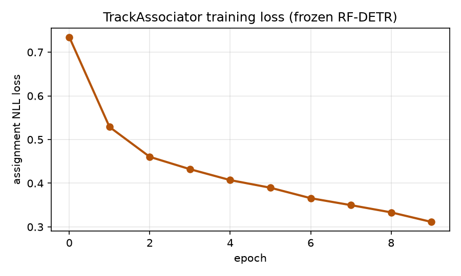
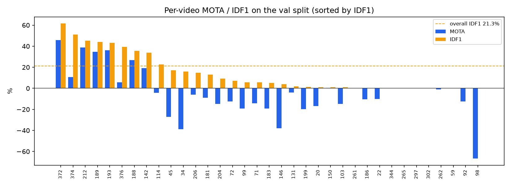
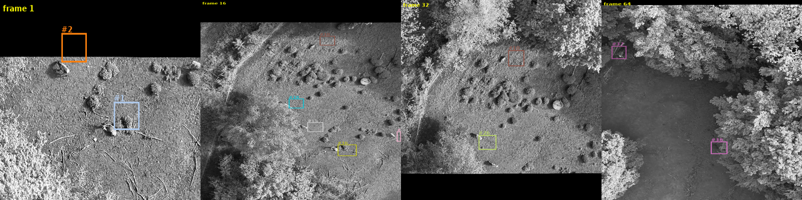
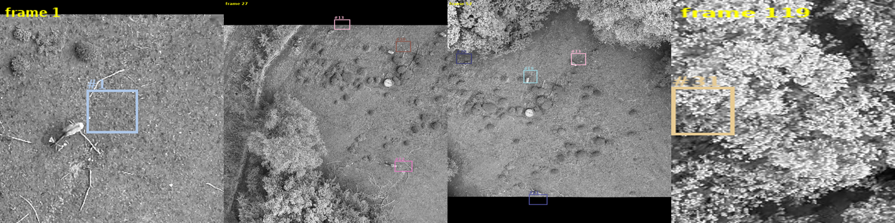
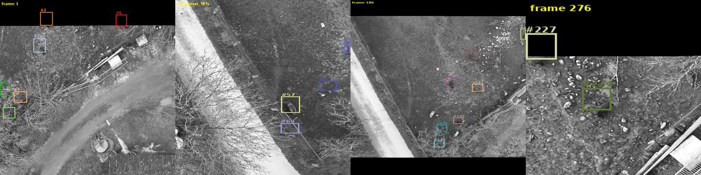

# End-to-End Transformer Tracking on RF-DETR — BAMBI Wildlife MOT

**Project:** BAMBI Wildlife MOT (CIV4) · **Module:** `transformer_tracking/`
**Detector:** RF-DETR-L (frozen) · **Tracker:** learned `TrackAssociator` (MOTRv2-style)
**Date:** 2026-06-22 · **Hardware:** single NVIDIA RTX 4070 (12 GB)

---

## 1. Summary

This module adds a **learned, end-to-end multi-object tracker** to the BAMBI
project. Unlike the tracking-by-detection baselines (SORT / ByteTrack / BoT-SORT,
which use hand-coded Kalman + IoU/ReID association), here the **cross-frame
association is learned by a neural network**, while the detector — the project's
already-trained **RF-DETR-L** — stays **frozen**. This is the MOTRv2 idea
(strong frozen detector + learned association), adapted to train on a single
RTX 4070.

On the validation split (35 videos, 2,621 frames, 6,297 GT instances) the tracker
reaches an **overall IDF1 of 21.3 %** and **MOTA of 1.2 %**, with much stronger
results on sequences where the frozen detector has good recall
(e.g. video 372: **IDF1 61.5 %, MOTA 45.8 %**).

---

## 2. Architecture


Two consecutive frames are passed through the **frozen RF-DETR-L**. For each
frame we read out the decoder's **300 per-query embeddings** (the 256-d hidden
states `hs[-1]`) together with their predicted boxes and class logits. These
object descriptors of frame *t-1* and frame *t* are fed to the trainable
**`TrackAssociator`**, which produces a soft assignment between the two frames'
detections plus "dustbin" rows/columns that absorb track **births** and
**deaths**.

| Component | Role | State | Params |
|---|---|---|---|
| **RF-DETR-L** (`checkpoint_best_ema.pth`) | per-frame detection + 256-d query embeddings | **Frozen** ❄ | ~ all frozen |
| **TrackAssociator** | learns frame-to-frame association | **Trained** ● | **4.42 M** |

### How the detector is reused (and frozen)

- RF-DETR-L was trained earlier in the project for **detection** on the 3 BAMBI
  classes (Wild boar, Red deer, Roe deer) at resolution 704, 300 object queries.
- We load `detection_models/rf-detr-l/output/checkpoint_best_ema.pth`, set every
  parameter to `requires_grad = False`, and call `.eval()`. A **forward hook on
  the transformer** captures `hs[-1]` (`[1, 300, 256]`) — the per-query
  embeddings — which RF-DETR computes but does not normally return.
- Because the detector is frozen, its embeddings are identical every epoch, so we
  **precompute them once** and cache to disk; training then never re-runs the
  detector (see §5).

### The trainable associator

A SuperGlue-style attentional matcher:

- Input projection of the 256-d embeddings + an MLP positional encoding of each
  box's `cxcywh` geometry.
- **4 self-attention + 4 cross-attention** layers (8 heads, dim 256) that let the
  two frames' detections exchange context.
- A dot-product score matrix passed through a **log-domain Sinkhorn** optimal
  transport (50 iterations) with a learnable **dustbin** for unmatched detections.
- Trained with the **negative log-likelihood** of the ground-truth correspondences.

---

## 3. Data

- **Dataset:** BAMBI — nadir **thermal** UAV footage of wildlife, annotated in
  **COCO MOT** format (`annotations/instances_*.json`) with global `track_id`,
  `video_id`, and dense per-video `frame_id`.
- **Classes (3):** Wild boar, Red deer, Roe deer.
- **Frames:** 1024 × 1024, resolved on disk against `data/yolo_data/*/images`
  (100 % coverage by basename — no re-annotation, no copies).

| Split | Images | Videos | GT instances | Clips (len 2) |
|---|---|---|---|---|
| train | 16,153 | 166 | 45,571 | 15,987 |
| val | 2,621 | 35 | 6,297 | 2,586 |

A **clip** is `clip_len` frames adjacent in `frame_id` within one video; track IDs
persist across the clip and supply the association targets.

---

## 4. Building the training targets

For each frame we (1) keep RF-DETR queries with score ≥ 0.3 (cap 100), (2) assign
each kept detection to a ground-truth object by **greedy IoU ≥ 0.5** to recover
its `track_id`, and (3) for a frame pair, two detections form a **positive match**
when they share a `track_id`; everything else (including background detections)
goes to the **dustbin**. The associator is trained to reproduce these matches.

---

## 5. Training procedure

The detector is frozen, so only the 4.42 M-param associator trains.

**Embedding cache (the key efficiency step).** RF-DETR is run over every frame
**once** and its kept detections (`embeds, boxes, scores, labels`, fp16) are
cached to disk (≈ 54 MB for the val split). Training reads tensors from the cache
and runs only the tiny matcher — no per-epoch detector recompute and no 1024²
image decoding in the hot loop. This is what keeps the GPU from being starved.

| Setting | Value |
|---|---|
| Trainable params | 4.42 M (associator only) |
| Clip length | 2 (consecutive frames) |
| Clips / epoch | 15,987 |
| Epochs | 10 |
| Optimiser | AdamW, lr 1e-4, weight decay 1e-4 |
| Effective batch | 8 (grad-accum, 1 clip/step) |
| Loss | Sinkhorn assignment NLL |
| Wall-clock | **1 h 03 m** total (≈ 6 min/epoch) |
| Peak VRAM (cached train step) | ≈ 0.1 GB |



Loss falls monotonically from **0.735 → 0.311** over the 10 epochs.

---

## 6. Inference

Online, per video: each frame's confident detections are linked to the
**previous frame's** detections via the learned assignment (mutual-nearest +
dustbin threshold). Matched detections inherit the track id; unmatched current
detections start new tracks. Output is written as MOTChallenge txt per video and
scored with CLEAR-MOT + IDF1 (`motmetrics`), matching the metric family used for
the BoxMOT baselines in `README(Track).md`.

---

## 7. Results (val split)

### What the metrics mean

The two headline numbers come from the standard MOT literature; higher is better
for both.

- **MOTA — Multiple Object Tracking Accuracy.** A single detection-quality score
  that combines the three error types, normalised by the number of ground-truth
  boxes:

  > MOTA = 1 − (FN + FP + IDSW) / GT

  where **FN** = missed objects, **FP** = false detections, **IDSW** = identity
  switches, **GT** = total ground-truth instances. MOTA rewards *finding the
  right boxes* and punishes misses/false alarms heavily; because the three errors
  can together exceed GT, **MOTA can go negative** (as it does on several of our
  low-recall sequences). It largely reflects **detection** quality.

- **IDF1 — Identity F1.** The F1 score (harmonic mean of identity precision and
  identity recall) over how long each predicted track keeps the **correct
  identity** matched to a ground-truth object across the whole video. Unlike MOTA,
  IDF1 cares about **association consistency** — keeping the *same* id on the
  *same* animal over time, not just per-frame box accuracy. It is the better
  measure of *tracking* quality.

In short: **MOTA ≈ "did we detect the objects?"**, **IDF1 ≈ "did we keep their
identities?"** A tracker can have decent IDF1 but low/negative MOTA if the
detector misses many frames (our case on dark sequences), or good MOTA but poor
IDF1 if it detects well but swaps identities.

Supporting columns: **IDSW** identity switches · **FP** false positives ·
**FN** false negatives (misses) · **MT/ML** mostly-tracked / mostly-lost
trajectories (≥80 % / ≤20 % of life covered) · **Frag** track fragmentations ·
**Prec/Rec** detection precision / recall.

### Overall

| MOTA | IDF1 | IDSW | FP | FN | GT | MT | ML | Frag | Prec | Rec |
|---:|---:|---:|---:|---:|---:|---:|---:|---:|---:|---:|
| **1.2 %** | **21.3 %** | 256 | 1,160 | 4,805 | 6,297 | 39 | 277 | 196 | 56.3 % | 23.7 % |



Performance is **strongly bimodal** and tracks the frozen detector's recall:
where RF-DETR fires reliably the tracker does well; where it misses the animals
(many dark thermal sequences) recall — and therefore MOTA — collapses. The
overall MOTA is dragged down by **4,805 false negatives** (recall 23.7 %), i.e.
missed detections, not by association errors.

### Best sequences

| Video | MOTA | IDF1 | IDSW | Prec | Rec | Note |
|---|---:|---:|---:|---:|---:|---|
| 372 | 45.8 % | 61.5 % | 0 | 86.7 % | 54.2 % | clean, few animals |
| 212 | 38.9 % | 45.2 % | 2 | 79.5 % | 57.4 % | |
| 193 | 36.0 % | 43.2 % | 9 | 80.1 % | 53.6 % | |
| 189 | 34.6 % | 44.0 % | 30 | 82.7 % | 62.0 % | crowded, more switches |
| 374 | 10.7 % | 51.0 % | 0 | 56.5 % | 46.4 % | |
| 142 | 19.3 % | 33.8 % | 103 | 72.6 % | 38.8 % | 276 frames, very crowded |

(The full 35-video table is in `images/metrics_table.csv`.)

---

## 8. Qualitative results

Predicted tracks (box colour = track id), zoomed onto the animals and contrast-
enhanced for the thermal imagery.

**Video 372 — best sequence (IDF1 61.5 %):**


**Video 189 — crowded herd:**


**Video 193:**


**Video 142 — dense scene (many simultaneous animals):**


**Ground truth (green) vs prediction (coloured), video 189:**


---

## 9. Discussion, limitations, next steps

- **Detector-bound, by design.** The detector is frozen, so tracking quality is
  capped by RF-DETR's recall on small, low-contrast thermal animals. The dominant
  error is **false negatives (missed detections)**, not identity switches — note
  how the high-recall sequences (189, 372) also have the best IDF1.
- **Comparison caveat.** The `README(Track).md` baselines were fed **ground-truth
  boxes** (detector-free), so their MOTA/IDF1 are **not directly comparable** —
  this module is the first to track from **real detections** end-to-end. A fair
  comparison would feed the same RF-DETR detections into ByteTrack/BoT-SORT.
- **No re-ID memory (v1).** Association is frame-to-frame only; a track that is
  missed for even one frame is dropped, producing fragmentations (196 total). A
  short **memory buffer** (keep lost tracks for `max_age` frames and match against
  them) is the obvious next improvement — the hook already exists in `infer.py`.
- **Other levers:** lower the detection `score-thresh` to trade FP for recall,
  train with `clip-len > 2`, or (heavier) fine-tune RF-DETR on thermal animals.

---

## 10. Reproduce

```bash
cd transformer_tracking
./precompute.sh                       # run frozen RF-DETR once, cache detections
./train.sh                            # 10 epochs, cached, frozen RF-DETR (~1 h)
uv --directory ../detection_models add motmetrics
./track_eval.sh val                   # track + score the val split

# regenerate this report's figures + PDF
PYTHONPATH=.. uv --directory ../detection_models run \
    python docs/make_report_assets.py
PYTHONPATH=.. uv --directory ../detection_models run \
    python docs/make_pdf.py
```

*Figures generated by `docs/make_report_assets.py`; metrics by `eval.py`
(`motmetrics`); training loss from the MLflow `bambi-tracking` run.*
